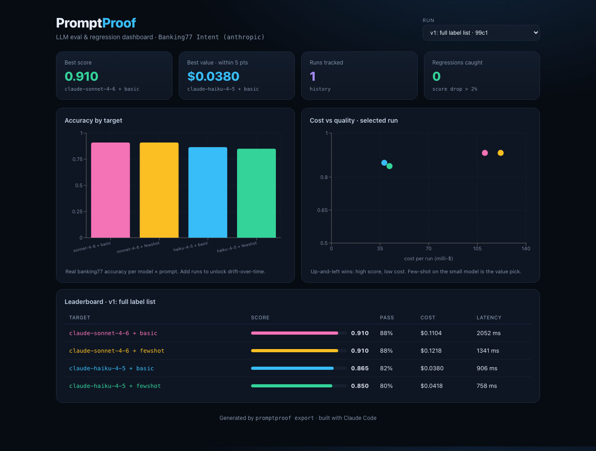

# PromptProof

**Catch LLM prompt & model regressions before they ship.**

Everyone ships LLM features. Almost nobody *tests* them. When you bump a model
version or "improve" a prompt, how do you know you didn't quietly make 12% of
outputs worse? PromptProof treats prompts like code: it runs an **eval suite**
on every change, **scores** the outputs, **compares against a baseline**, and
**fails CI** when quality drops.

> Works with real models (Anthropic / OpenAI) **and** fully offline via a
> deterministic `MockProvider` — so tests and the CI gate run with **zero API
> keys or cost**.



---

## Real results: benchmarking Claude on banking77

To prove it works on real data, the [`banking77_intent`](examples/banking77_intent)
example evaluates two **real Claude models** on **[banking77](https://github.com/PolyAI-LDN/task-specific-datasets)**
— a recognized benchmark of real banking customer-support messages labeled with
one of 77 intents. It pits a **basic vs few-shot** prompt against
**Haiku vs Sonnet**, scored on exact-match accuracy + JSON-schema validity.

**Actual output** (50 test cases, `temperature=0`, scored by PromptProof):

| Target | Accuracy | Pass rate | Cost (50 cases) |
|---|---|---|---|
| claude-sonnet-4-6 + basic   | **0.910** | 88% | $0.110 |
| claude-sonnet-4-6 + fewshot | **0.910** | 88% | $0.122 |
| claude-haiku-4-5 + basic    | 0.865 | 82% | **$0.038** |
| claude-haiku-4-5 + fewshot  | 0.850 | 80% | $0.042 |

What the measurement surfaced — none of it obvious in advance:

- **Few-shot examples didn't pay off here.** Sonnet scored *identically* with or
  without them (the basic prompt is cheaper), and on Haiku few-shot was slightly
  *worse* (0.865 → 0.850). The 3 examples added input cost for no accuracy gain.
- **Sonnet beat Haiku by ~5 points** (0.910 vs 0.865) — model size mattered, but modestly.
- **Best value: Haiku + basic — 86.5% at ~1/3 the cost** of Sonnet. Whether
  that trade is worth it is now a *decision you can see*, not a guess.

> Methodology / honesty: a 50-case sample at `temperature=0`, single run — treat
> it as a **directional** benchmark, not a published leaderboard. Everything is
> reproducible: [`prepare.py`](examples/banking77_intent/prepare.py) rebuilds the
> dataset + prompts + suites, and the run is one command.

## The regression gate (demonstrated offline)

The whole point is catching regressions automatically. The
[`support_ticket_triage`](examples/support_ticket_triage) example runs on the
**offline mock** (so it costs nothing and runs in CI). Take a passing prompt,
"refactor" it so it renames a field — then re-run:

```
## ❌ REGRESSION DETECTED — Support Ticket Triage
| Target          | Δ score | Δ pass | Status    | Newly failing        |
|-----------------|---------|--------|-----------|----------------------|
| large + fewshot | -0.367  | -100%  | regressed | t01, t02, … t14 (14) |
| small + basic   | +0.000  | +0%    | ok        | —                    |
```
```
exit code = 1   # CI fails the PR
```

## Architecture


## Quickstart

**Offline (no key needed):**
```bash
pip install -e .
promptproof run examples/support_ticket_triage/suite.yaml --set-baseline
promptproof run examples/support_ticket_triage/suite.yaml --fail-on-regression
```

**Real models:**
```bash
pip install -e '.[live]'
cp .env.example .env          # then add your OPENAI_API_KEY or ANTHROPIC_API_KEY
python examples/banking77_intent/prepare.py
promptproof run examples/banking77_intent/suite.anthropic.yaml --set-baseline
```

Other commands: `promptproof list`, `report`, `compare --candidate <id>`,
`baseline <id>`, `export --out dashboard/public/data`. Use `--limit N` for a
cheap smoke test.

## Built-in scorers

| Scorer | What it checks |
|---|---|
| `json_valid` | Output parses as JSON |
| `json_schema` | Required keys, types, and enums (no `jsonschema` dependency) |
| `field_exact` | A parsed field equals the gold value (case-insensitive) |
| `field_tolerance` | A numeric/mapped field is within N of gold (e.g. priority ±1) |
| `contains` | Output (or a field) contains any/all of some substrings |
| `regex` | Output (or a field) matches a pattern |
| `llm_judge` | A model grades a field against a reference (offline mock judge included) |

Scorers self-register, so adding one is a ~15-line file.

## Dashboard

`dashboard/` (Vite + React + TypeScript + Recharts) reads exported run history
and renders the leaderboard, accuracy/drift, and cost-vs-quality views above.

```bash
promptproof export --out dashboard/public/data
cd dashboard && npm install && npm run dev
```

## Design notes

- **Offline-first.** The engine, tests, and CI run without network or keys. The
  `MockProvider` is a prompt-driven simulator (it reads the JSON keys the prompt
  asks for and recognizes few-shot examples), so the regression demo works with
  no API.
- **Resilient.** Real providers retry transient errors (HTTP 429/529 overload)
  with exponential backoff — an eval that crashes on a blip reports false numbers.
- **Dependency-light.** Engine = stdlib + PyYAML. Real providers pull in
  `requests` only via the optional `[live]` extra.

## CI gate

[`.github/workflows/promptproof.yml`](.github/workflows/promptproof.yml) runs the
offline suite on every PR and fails the check on regression — the eval becomes a
release gate, same as your unit tests.

## Roadmap

- Markdown PR comment with the diff table (not just an exit code)
- Embedding-similarity scorer (optional `[embeddings]` extra)
- Per-case token/cost budgets and alerting

---

Built with Claude Code. Part of a 10-project series — see the repo root `PORTFOLIO.md`.
