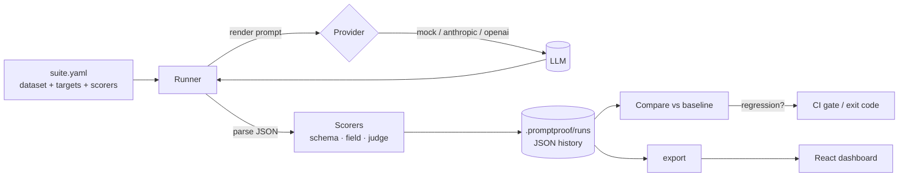

# PromptProof

**Catch LLM prompt & model regressions before they ship.**

Everyone ships LLM features. Almost nobody *tests* them. When you bump a model
version or "improve" a prompt, how do you know you didn't quietly make 12% of
outputs worse? PromptProof treats prompts like code: it runs an **eval suite**
on every change, **scores** the outputs, **compares against a baseline**, and
**fails CI** when quality drops.

> Runs **fully offline with zero API keys** via a deterministic `MockProvider`.
> Drop in `ANTHROPIC_API_KEY` / `OPENAI_API_KEY` to evaluate real models.


---

## Why it matters

A small but growing number of teams have actually *owned* an LLM system in
production and watched evals drift after a model bump. That discipline —
eval-first development, regression gates, cost/quality tradeoffs — is what this
project demonstrates end to end:

- **Eval suites as config** — a dataset + targets (model × prompt) + weighted scorers, in YAML.
- **7 built-in scorers** — structural, field-level, text, and **LLM-as-judge**.
- **Regression detection** — diff any run against a baseline; trip on score / pass-rate drops.
- **CI gate** — a GitHub Action that fails the PR when quality regresses.
- **Cost, latency & token tracking** — because quality is meaningless without the price tag.
- **Provider-agnostic** — `anthropic`, `openai`, or the offline `mock`.

## Example results

The bundled example triages support tickets into structured JSON, pitting two
prompts (basic vs few-shot) against two model tiers (small vs large). Real
output from `promptproof run`:

| Target | Score | Pass rate | Cost (USD) | Mean latency |
|---|---|---|---|---|
| large + fewshot | **0.959** | 100% | $0.0213 | 925 ms |
| small + fewshot | **0.943** | 100% | $0.0009 | 345 ms |
| large + basic | 0.863 | 71% | $0.0166 | 918 ms |
| small + basic | 0.848 | 71% | $0.0007 | 338 ms |

> **The insight a leaderboard like this surfaces:** the *small* model with a
> few-shot prompt (0.943) all but matches the *large* model with the same prompt
> (0.959) — at **1/24th the cost** — and beats the large model on a weak prompt.
> Prompt quality outweighed model size here. You only learn that by measuring.

## The regression gate in action

Someone "refactors" the winning prompt and renames `category` → `type` (and
drops `needs_human`). Re-run and compare:

```
## ❌ REGRESSION DETECTED — Support Ticket Triage
| Target          | Δ score | Δ pass | Status    | Newly failing        |
|-----------------|---------|--------|-----------|----------------------|
| large + fewshot | -0.367  | -100%  | regressed | t01, t02, … t14 (14) |
| small + basic   | +0.000  | +0%    | ok        | —                    |
```
```
exit code = 1   # CI fails the PR
```

## Architecture



## Quickstart

```bash
pip install -e .                        # zero deps beyond PyYAML; no API keys needed

# 1. Run the suite and pin this run as the baseline
promptproof run examples/support_ticket_triage/suite.yaml --set-baseline

# 2. Later, gate a change against that baseline (exits 1 on regression)
promptproof run examples/support_ticket_triage/suite.yaml --fail-on-regression

# Other commands
promptproof list                        # all stored runs
promptproof report                      # leaderboard for the latest run
promptproof compare --candidate <id>    # diff any two runs
promptproof export --out dashboard/public/data
```

**Use real models** by changing a target's `provider`/`model` and exporting a key:

```yaml
targets:
  - id: "gpt-4o-mini + v2"
    provider: openai          # or anthropic
    model: gpt-4o-mini
    prompt: prompts/v2_fewshot.txt
```
```bash
pip install 'promptproof[live]'
export OPENAI_API_KEY=sk-...
promptproof run examples/support_ticket_triage/suite.yaml
```

## Anatomy of a suite

```yaml
name: Support Ticket Triage
dataset: dataset.jsonl
targets:
  - { id: "small + fewshot", provider: mock, model: mock-small, prompt: prompts/v2_fewshot.txt }
scorers:
  - name: json_schema
    weight: 1
    config: { required: [category, priority, sentiment, needs_human, summary], properties: {...} }
  - name: field_exact
    weight: 2
    config: { field: category }       # the core task, weighted highest
  - name: llm_judge
    weight: 1
    config: { field: summary, provider: mock, model: mock-large, threshold: 0.4 }
thresholds: { max_score_drop: 0.02, max_pass_rate_drop: 0.05 }
```

## Built-in scorers

| Scorer | What it checks |
|---|---|
| `json_valid` | Output parses as JSON |
| `json_schema` | Required keys, types, and enums (no `jsonschema` dependency) |
| `field_exact` | A parsed field equals the gold value (case-insensitive) |
| `field_tolerance` | A numeric/mapped field is within N of gold (e.g. priority ±1) |
| `contains` | Output (or a field) contains any/all of some substrings |
| `regex` | Output (or a field) matches a pattern |
| `llm_judge` | A model grades a field against a reference (offline mock judge included) |

Scorers register themselves, so adding one is a ~15-line file.

## CI gate

`.github/workflows/promptproof.yml` runs the suite on every PR and fails the
check on regression — the eval becomes a release gate, same as your unit tests.

## Project layout

```
promptproof/
  providers/   mock · anthropic · openai   (pluggable LLM backends)
  scorers/     structure · fields · text · judge   (self-registering)
  runner.py    targets × cases × scorers, concurrent
  compare.py   baseline regression detection
  store.py     JSON run history under .promptproof/
  cli.py       run · compare · report · list · baseline · export
examples/support_ticket_triage/   runnable suite + dataset + 3 prompts
dashboard/     Vite + React + TypeScript drift dashboard (Recharts)
tests/         pytest (scorers, runner, regression)
```

## Design notes

- **Offline-first.** The whole tool, its tests, and the demo run without network
  or keys. The `MockProvider` is a tiny prompt-driven simulator: it reads the
  JSON keys requested *in the prompt* and recognizes few-shot examples, so
  different prompts/models produce genuinely different scores — and the
  regression demo works with no API.
- **Dependency-light.** The engine is standard library + PyYAML. Real providers
  pull in `requests` only via the optional `[live]` extra.

## Dashboard

The dashboard (Vite + React + TypeScript + Recharts) reads exported run history
and renders the leaderboard, score-drift-over-time, and cost-vs-quality views
above.

```bash
promptproof export --out dashboard/public/data   # refresh from your runs
cd dashboard && npm install && npm run dev        # http://localhost:5173
```

## Roadmap

- HTML/Markdown PR comment with the diff table (not just exit code)
- Embedding-similarity scorer (optional `[embeddings]` extra)
- Per-case token/cost budgets and alerting
- Parallel across targets, not just cases

---

Built with Claude Code. Part of a 10-project series — see the repo root `PORTFOLIO.md`.
